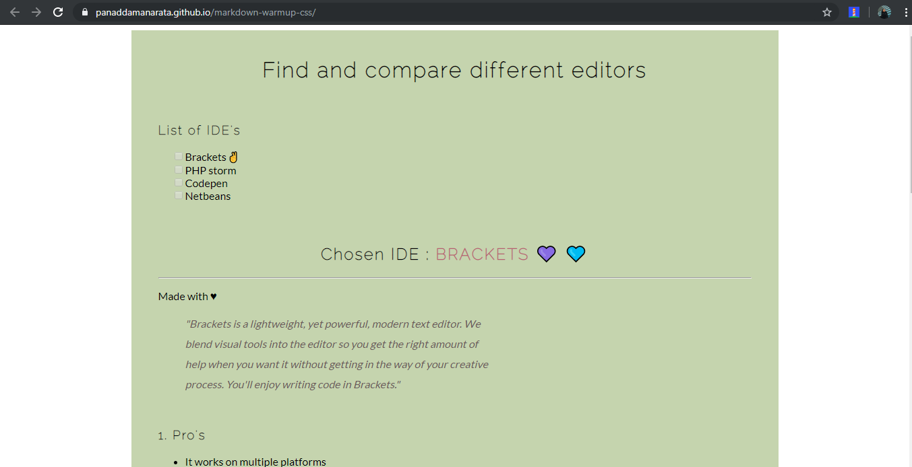

# Markdown warmup with some CSS 
Turning Markdown language to HTML and style with CSS 

style previous assignment [from markdown to HTML](https://panaddamanarata.github.io/markdown-to-html/)

[HTML styled](https://panaddamanarata.github.io/markdown-warmup-css/)

